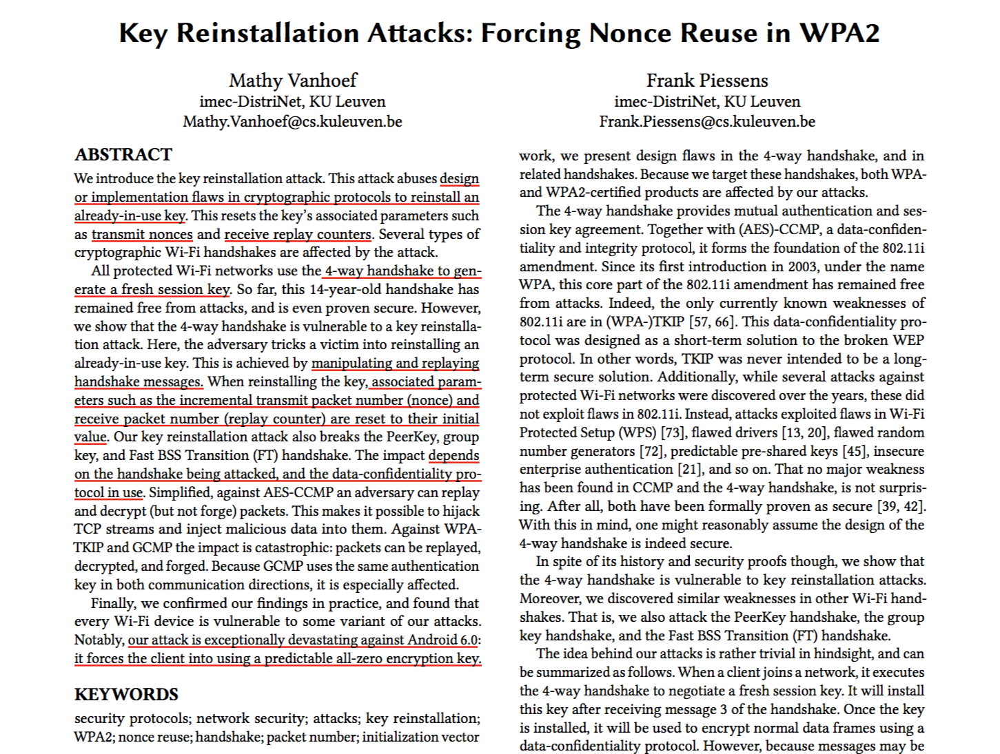
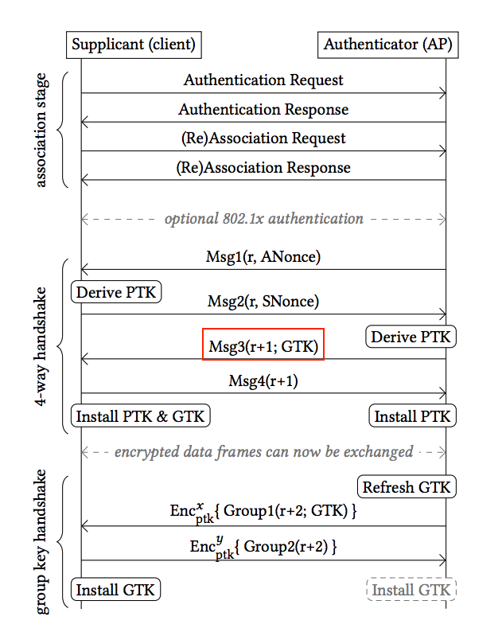

# Tekkiwartti

KRACK: Key Reinstallation Attacks

---

# So, whattt?

- When: discoverd in 2016, notified vendors at July 14, 2017, publish in Public at Oct 16, 2017

- Who: Mathy Vanhoef (Belgian PhD Researcher of Network Security & Applied Crypto)

- What:  Any data or information that the victim transmits can be decrypted, inject packets (TKIP or GCMP ONLY)

- Why: protocol design flaw (WPA2 four-way handshakes) + implementation bug (linux based systems)

- How: reinstall an already-in-use key by manipulating and replaying handshake messages

- Affected devices: 
    * Any device that uses Wi-Fi is likely vulnerable 
    * Especially Linux and Android, but also the WPA2 implementations of other operating systems (macOS, iOS, Windows).
    * Access points that use the affected 802.11r standard or are set up as repeaters

---

---

# Details

- WPA2 4-way handshake to negotiate a shared key with router

- Key + nonces are used for encrypting packets

- How it is used depends on the actual crypto algorithm being used

- Crypto attack if certain valuers are reused 

- KRACK: force reusing same values

- Software bug was found in some linux based systems 

- Key reset to all zero: 00000000000

---

- PTK: Pairwise Transient Key =  Pairwise Master Key(PMK) + AP nonce(ANonce) + STA nonce(SNonce) + AP MAC address + STA MAC address
- GTK: Group Temporal Key -> decrypt multicast and broadcast traffic
---

# Bad News

- Adversary can decrypt arbitrary packets
    * This allows an adversary to obtain the TCP sequence numbers of a connection, and hijack TCP connections.

- Adversary can replay broadcast and multicast frames

- Adversary can both decrypt and inject arbitrary packets. (TKIP or GCMP ONLY)

- Adversary can force the client into using a predictable all-zero encryption key. (ANDROID 6.0+ and LINUX)

- The attack works for both clients and access points

- Attacks against Android 6.0+ and linux devices are very easy to accomplish

- Updates may never come for many IoT devices
---

# Good News

- Adversary can not recover WPA password

- Adversary can not inject packets. (AES-CCMP ONLY)

- Physical Proximity: An attack can only happen when adversary is in physical proximity to and within wireless range of your network

- Time Window: An attack can only happen when a client device is connecting or reconnecting to a Wi-Fi network

---

# What you can do ?

1. Check with device vendor if the security patch is available

2. Patch all the devices that are able to be patched: router, mobiles, laptop, IoT devices etc.

3. If patch is not available, replace wireless connections with either wired connections or cellular connection

4. Replace all devices that cannot be patched

5. Place devices on separate, restricted subnets/networks/VLANs and place devices on dedicated wireless networks; then, enforce different access controls per subnet

6. Always only visit website with HTTPS

---

### What I learn ?

- Curiosity, Critical thinking, source code reading

- How to prevent these types of bugs: "Need more rigorous inspections of protocol implementations"

---

# Firmware patch status (Last Update: Nov 1, 2017)

“We’re probably still going to find vulnerable devices 20 years from now”

Phones: 
- iOS:white_check_mark: iOS 11.1 (Release Date: Oct 31, 2017)
- Android:warning: : Fixed at patch level "November 6, 2017." Rolls out soon to Pixel + Nexus
- Samsung:warning: : Modern Samsung devices receive Google security patches, but older ones don't. No comment on those

OS:
- macOS:white_check_mark: : macOS 10.11.1 (Release Date: Oct 31, 2017)
- Windows:white_check_mark: : Windows 7, 8, 8.1, 10 (October 10th)
- Linux:white_check_mark: : Ubuntu 14.04+, Arch, OpenBSD, Debian, Gentoo, Linux upstream
- Raspberry Pi:white_check_mark: : Fixed (sudo apt update && sudo apt upgrade)

Router:
- Cisco:white_check_mark: : Updates available across Cisco hardware
- TP Link:warning: : Has been working to solve this problem (http://www.tp-link.fi/faq-1970.html)
- Google WiFi:warning: : Google says a fix will roll out "soon"

IoT Devices:
- Amazon:warning: : "In the process of reviewing devices." No fix issued for Echo etc 
- Other IoT devices :sos: : probably patch will never reach them

https://www.kb.cert.org/vuls/byvendor?searchview&Query=FIELD+Reference=228519&SearchOrder=4
https://github.com/kristate/krackinfo

:white_check_mark: = Available for download and patched
:warning: = Fix pending release or in beta
:x: = No known fix
:sos: = Pray to god 

